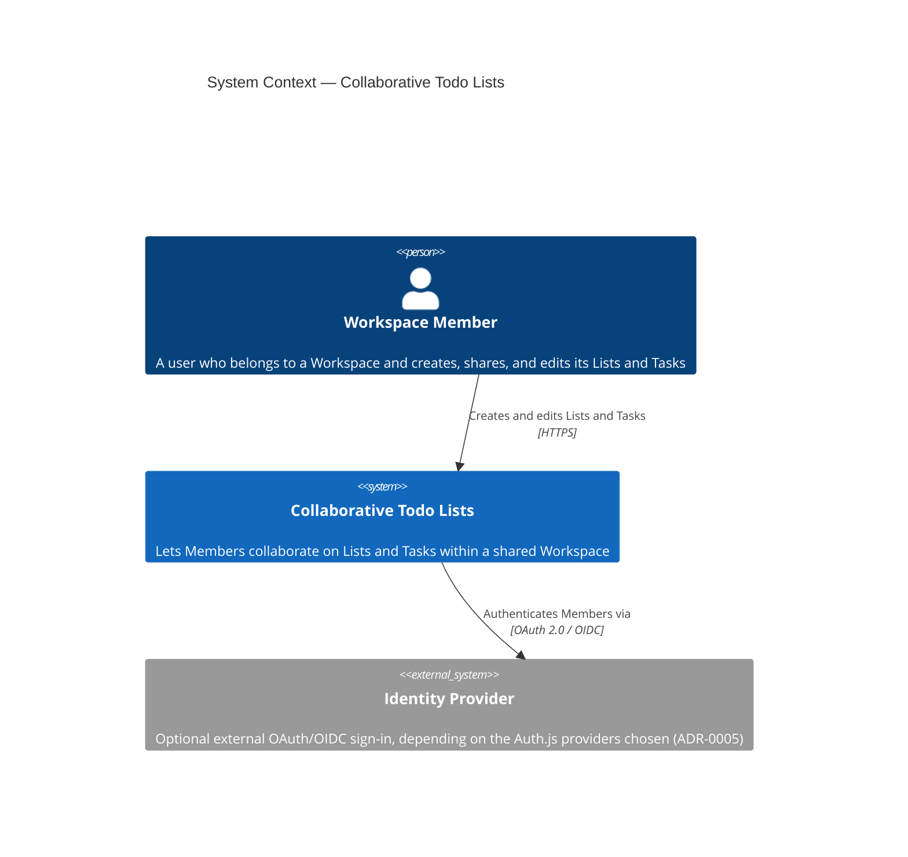
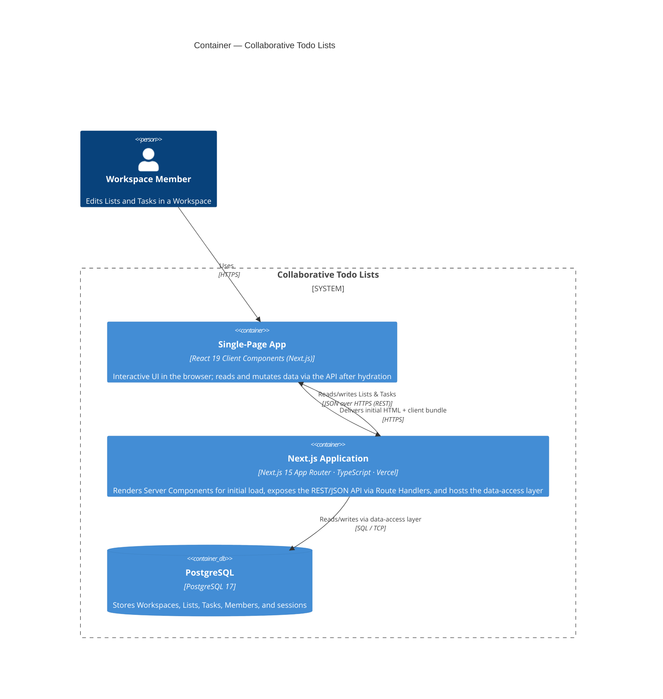

# Architecture Overview (C4)

Visual model of the **Collaborative Todo Lists** system, following the
[C4 model](https://c4model.com/) (Context and Container levels). These diagrams
illustrate the architecture; the **decisions and their rationale live in the
[ADRs](../adr/)**, which are the source of truth. Where a box or arrow below
encodes a decision, the governing ADR is cited.

> **Status:** the application has no code yet — these diagrams are authored
> top-down from the intended design (ADR-0001 through ADR-0005), not generated
> from a codebase. Revisit them once code exists.

## Level 1 — System Context

Who uses the system and what it depends on.

The Identity Provider is dashed/optional: it exists only if ADR-0005's auth
configuration uses an external OAuth provider. Email/credential sign-in needs no
external system.

## Level 2 — Containers

The runnable parts of the system and how they communicate. The browser SPA and
the Next.js server ship from **one Next.js codebase and deployment** but execute
in **different runtimes** (the user's browser vs. Vercel), so they are modelled
as distinct containers.

### How the containers map to the ADRs

| Container / relationship                                                  | Decision                                                    | ADR                                                                   |
| ------------------------------------------------------------------------- | ----------------------------------------------------------- | --------------------------------------------------------------------- |
| Next.js Application (App Router, Server Components by default, on Vercel) | Adopt Next.js as the frontend framework                     | [ADR-0001](../adr/0001-adopt-nextjs-as-frontend-framework.md)         |
| SPA → Next.js over **REST/JSON via Route Handlers**                       | Expose an explicit API consumed by Client Components        | [ADR-0002](../adr/0002-rest-json-api-via-route-handlers.md)           |
| **PostgreSQL** container                                                  | PostgreSQL as the primary database                          | [ADR-0003](../adr/0003-postgresql-as-the-database.md)                 |
| Next.js → PostgreSQL via a **data-access layer**                          | TypeScript query layer + migrations                         | [ADR-0004](../adr/0004-data-access-with-orm-and-migrations.md)        |
| Member → SPA (authenticated session); workspace-scoped access             | Auth + workspace-scoped authorization, enforced server-side | [ADR-0005](../adr/0005-authentication-and-workspace-authorization.md) |

## What is intentionally not shown

- **Level 3 — Components** (e.g. Route Handler → service → repository →
  PostgreSQL inside the Next.js Application) is deferred until code exists; it is
  the natural next diagram to add.
- The **real-time collaboration** mechanism is unresolved (assumption A1) and is
  therefore absent from the SPA ↔ Next.js relationship beyond request/response.

## Notes on rendering

These use Mermaid's native `C4Context` / `C4Container` diagram types, which
GitHub-flavored Markdown renders. If a renderer in your toolchain does not
support C4, the same model can be expressed as a Mermaid `flowchart` without loss
of meaning.
